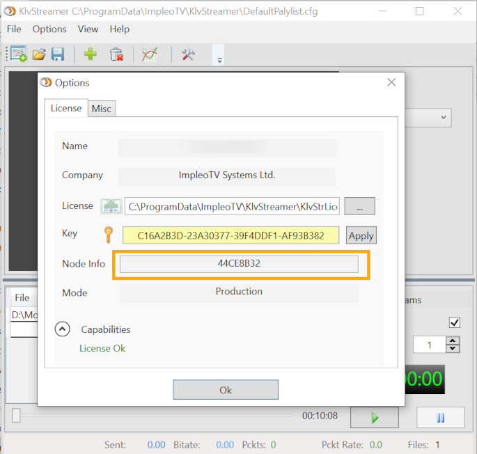

  

# KlvStreamer

**KlvStreamer** is a software for re-streaming STANAG TS files over IP networks.
More [info](https://impleotv.com/products/applications/klvstreamer).

## System Requirements

OS: Windows 10 64 bit.

## Installation

> Note: Microsoft has removed some servers, so the required dependencies are not downloaded automatically anymore. You may need to download and install them manually

### Prerequisites 
VC++ runtime (2010 and 2013, 32 bit) must be present on your PC (so the application could be installed and run properly). You have to download 2 small files from MS servers as you most likely don't have them installed.

1. Download [Microsoft Visual C++ 2010 Service Pack 1 Redistributable Package MFC Security Update](https://nam11.safelinks.protection.outlook.com/?url=https%3A%2F%2Fwww.microsoft.com%2Fen-us%2Fdownload%2Fdetails.aspx%3Fid%3D26999&data=04%7C01%7Cmmrva%40alionscience.com%7C0a48be93135b4e438bc608da12d67d5e%7Cb467f7f8a94a4b7a8d979a9b05951bd8%7C0%7C0%7C637843010768689313%7CUnknown%7CTWFpbGZsb3d8eyJWIjoiMC4wLjAwMDAiLCJQIjoiV2luMzIiLCJBTiI6Ik1haWwiLCJXVCI6Mn0%3D%7C1000&sdata=mZnOEw5abHPXwdhdI5qObRpwAvx33tOqVOEIiHGVBqI%3D&reserved=0)

Click Download and select **vcredist_x86.exe** and run the installer

2. Download [Visual C++ Redistributable Packages for Visual Studio 2013 from Official Microsoft Download Center](https://nam11.safelinks.protection.outlook.com/?url=https%3A%2F%2Fwww.microsoft.com%2Fen-us%2Fdownload%2Fdetails.aspx%3Fid%3D40784&data=04%7C01%7Cmmrva%40alionscience.com%7C0a48be93135b4e438bc608da12d67d5e%7Cb467f7f8a94a4b7a8d979a9b05951bd8%7C0%7C0%7C637843010768689313%7CUnknown%7CTWFpbGZsb3d8eyJWIjoiMC4wLjAwMDAiLCJQIjoiV2luMzIiLCJBTiI6Ik1haWwiLCJXVCI6Mn0%3D%7C1000&sdata=knjULmvl44fhOyPxxIvBroc51S9EvK3gSOYGQCWIQi4%3D&reserved=0)

Click Download and select **vcredist_x86.exe** and run the installer

**KlvStreamer** can be downloaded as a **zip** file that contains installer.  
Unzip the **KlvStreamerSetup-V.1.0.29** file and run the **setup**.

## Download link

|          | Version             | Download link                                                           | 
|:---------|:-------------------:|:------------------------------------------------------------------------|
| **KlvStreamer** |  v1.0.0.29 | [KlvStreamerSetup-V.1.0.29](https://github.com/impleotv/klvstreamer-release/releases/latest/download/KlvStreamerSetup-V.1.0.29.zip) | 

## License

**KlvStreamer** is a node locked software. In order to get the license, please install it and fill an [online form](https://docs.google.com/forms/d/e/1FAIpQLSd_XW6bDsFce1G1cpds4gMQNlwNax0CvkWzcMbscxZ5rLaIbA/viewform), providing the ***Node Info*** string (IMPORTANT!!!) for the target machine.  
***Node Info*** string can be found at ***Options->License***, as shown below.

Please copy-paste *Node Info*, don't send an image...

You'll get back a **license** file and a **key**.
Select the license file in the *Options/License* page and apply the provided key.
